# ICG Indiv 2 Gabe Kotton (100817029)

## Lighting 

Forward rendering is earlier version of rendenring, and is more flexible because each object will under go it's own screen space shading. This provides the benefit of flexibility (as mentioned earlier), but run time operations become more expensive.  

Forward rendering is most commonly used in shader because it provides the advantage of multiple passes. The majority of the shaders we made in class (I believe excluding the shadows) are forwardly rendered. I also believe that most things when made in shaders are forward rendered unless declared otherwise. 

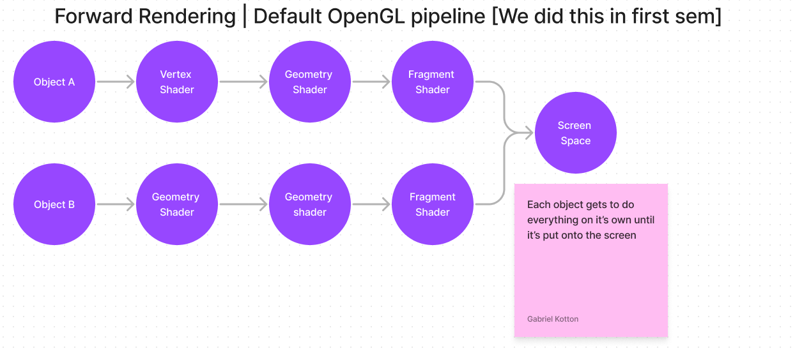

Deferred rendering is an advanced lighting technique commonly used for things like shadows. It takes advantage of the render pipeline by combining everything into one last final step where lighting is calculated in screen space.
This buffer is called the G-Buffer.

As mentioned earlier, deferred rendering is commonly used when making shadows, this is visible inside unity (Atleast HDRP pipelines) where you can see shadow casters as deferred renderers in the  Window->Analysis->HDRP (It's not called HDRP, it's something similar tab

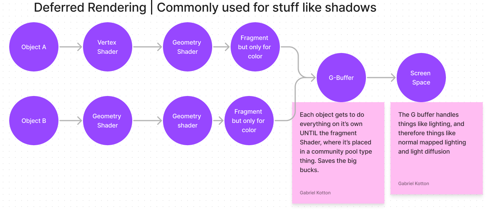

Both options of rendering are valuable and important. Commonly in CG we aim for our things to be on the differed render pipeline to optimize GPU operations, but some operations can only be done on the forward render. 

## Game Part 1 

Shown above is a gif of the game after the first section include square waves (Note the period and intensity are changable) and a toon shader gives color so the deeper water is darker.

Also, you can move and point your harpoon thing. Though you really shouldn't be killing sharks.

The shader used to get the water look is a combo of water shader & toon ramp shader. 

First; the water shader -- We need to access the verticies of the mesh to achieve a square wave. Then we apply a regular sine wave function to achieve a wave, then we clamp the wave to either be a 1 or -1 (Whichever is closest)
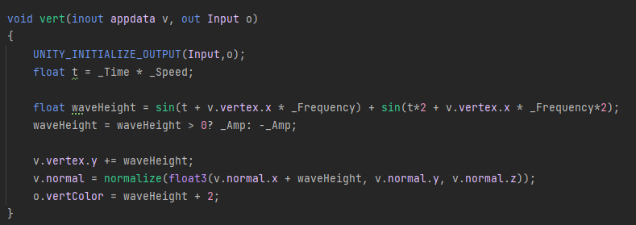

Next, we need to implement our toon ramp && we need to apply our finial colors. So, using a surface shader, and unity black magic, we create our toon ramp which just chooses a multiplicable color based on angle from light.
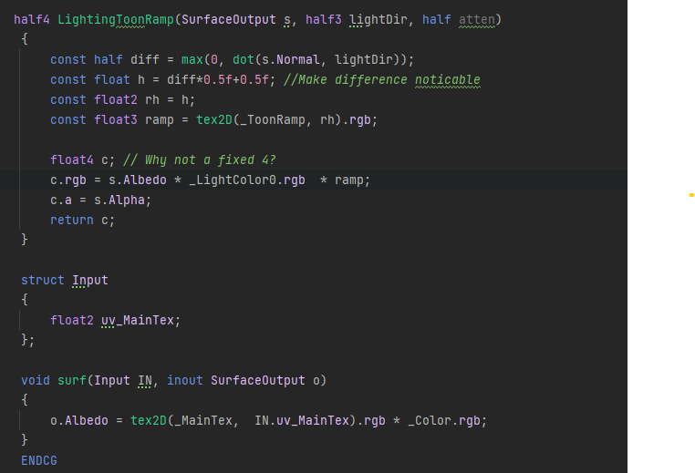

## Explain the following code snippet:
(I added comments)

This code is a pixellate camera shader that essentially reduces the resolution of the screen into different chunks and then returns them with lower resolutions.
This can be used in the shark game (Go figure) because it makes things pixelly. So I will be using it in the shark thing.
This kind of effect can be used to emulate old school pixel games w/o actually making the textures pixelly
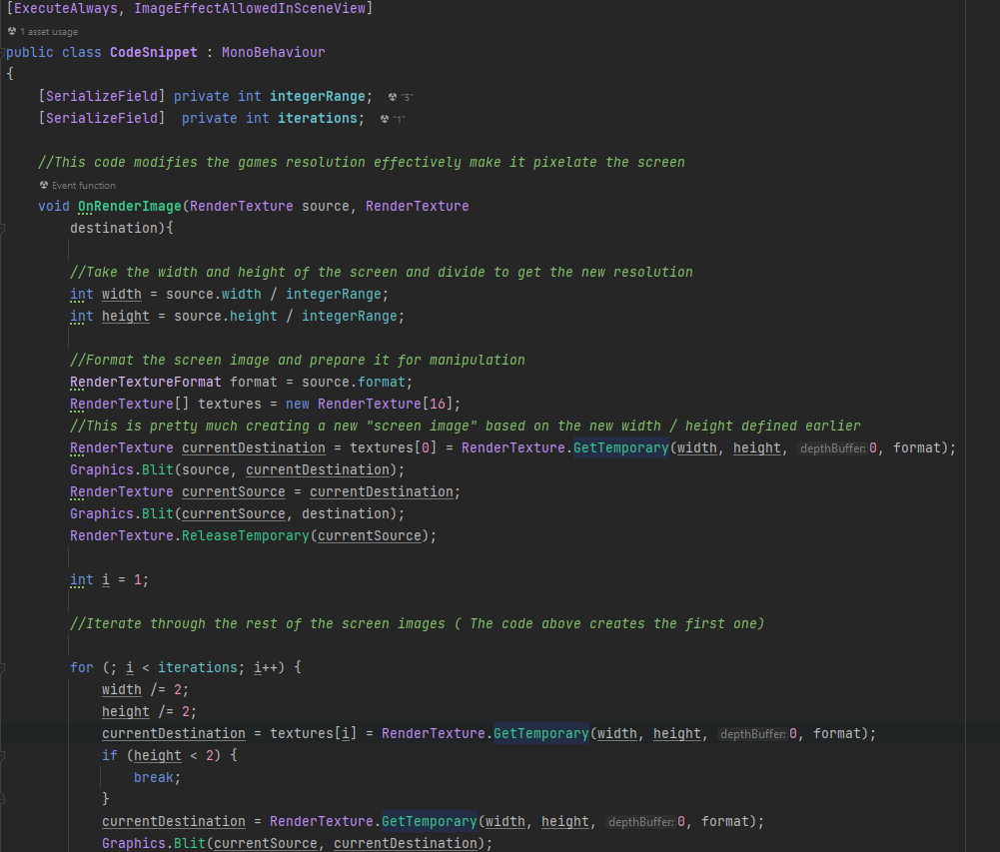
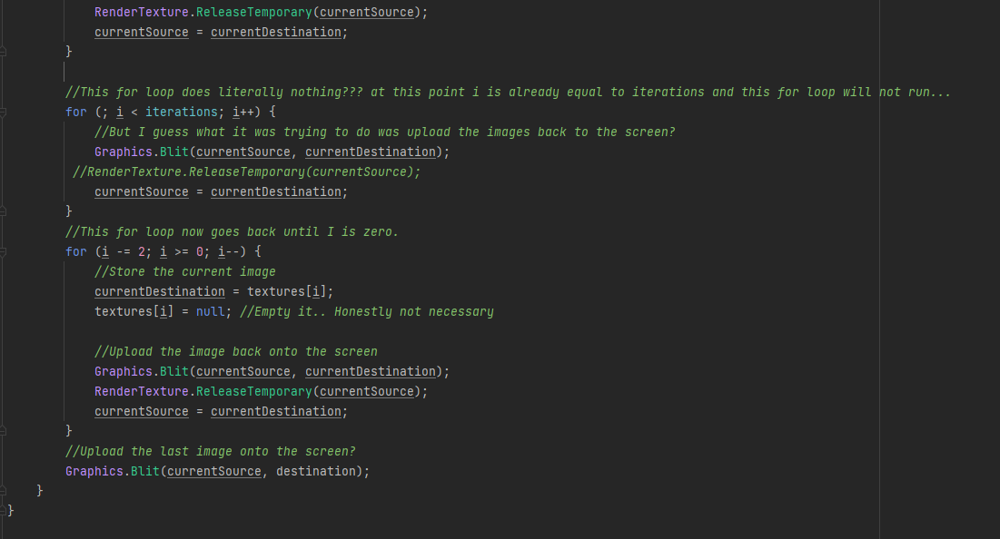
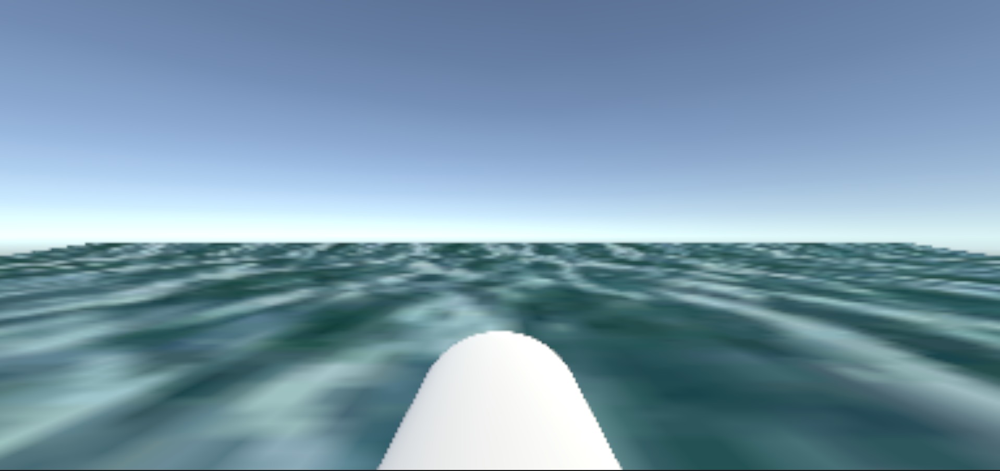

## Code snipper part 2 (Because it can be used in Game part 2, I'm doing it first.)

This is a shadow coloration shader, it allows us to change the color of the shadows that are landing on the object with our material.
I've attached this to the shark so it's easier to visualize NOTE how the shadow on it's underside (The shadow it casts onto itself) is colored, but the shadow it casts onto the plane below it is regular.
Also note, that the toon ramp makes it A LOT harder to see shadows 
This kind of effect can be used to help provide contrast (Just like in the shark)

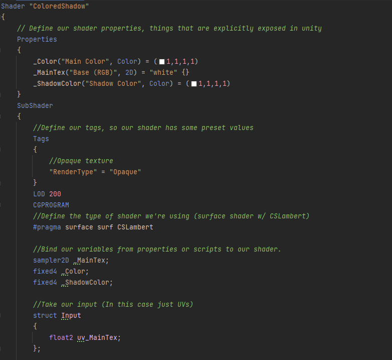
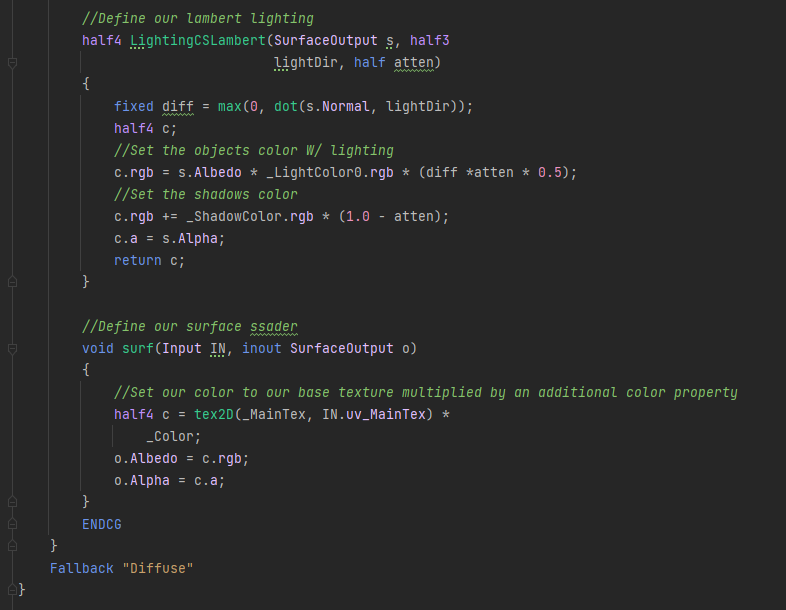
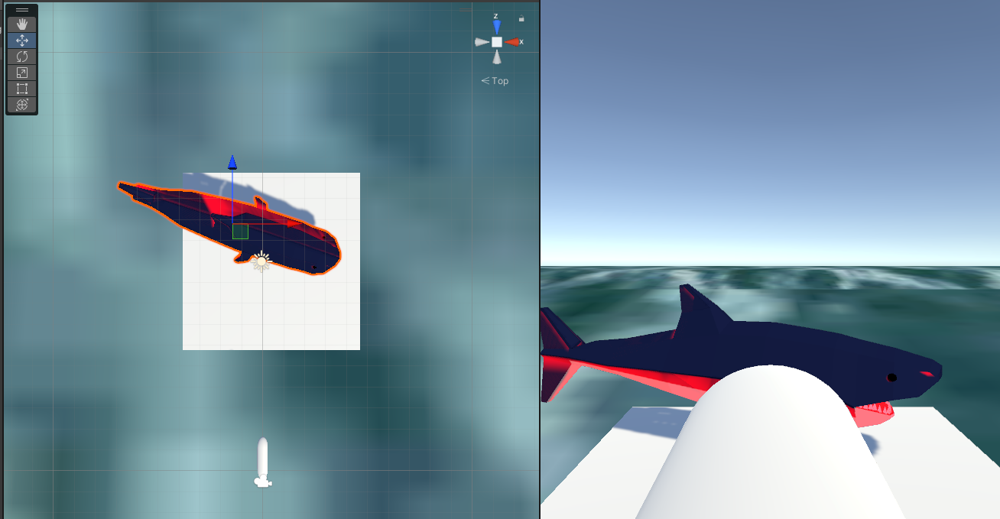
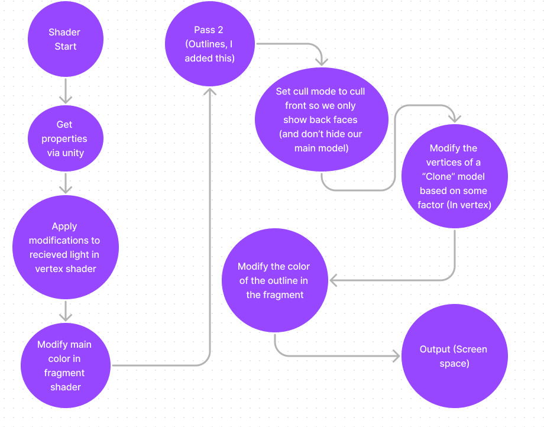

Note: This diagram has two passes because in the next part I create a second pass to handle outlining.

## Game part 2 

Okay so technically at this point, vertex extrusion is already happening in the water, and shadows are being handled by the shark...
So to feel like I did something, let's implement bloom & Outlines.

First I added an outline pass to the shark shadow shadow, then I connected that outline pass to my C# script and added some code that raycasts forward from the player position
If we're seeing the layer w/ the shark on it, then the shark goes red. 
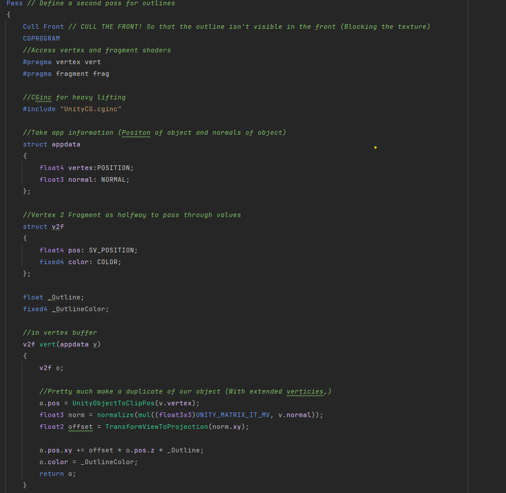
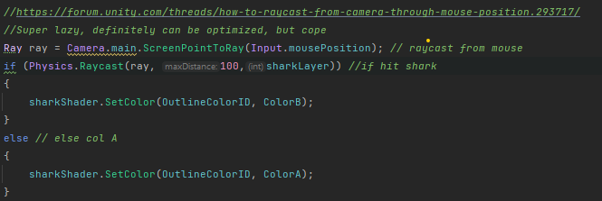

Next I made a laser pointer to it's clear where the player is aiming and I applied emission to it so that the bloom affect I'd add next would look better.

Then I added bloom to the project, this will highlight bright and glowing spaces, so if you look at the water, it'll have a slight glow where there are white spots and if you look at the laser, it's not pixellated like everthing else because bloom happens after pixels

The bloom shader is enormous, so it's a copy paste 1to1 w/ variables changed from the lectures.
because honestly, it worked great from the lecture, so why change it? Especially because I technically implemented all 4 tasks (With modifications to the other ones).

Because I don't really know what to say about this besides for taking a dozen screenshots, let's talk about the variables that I manipulated
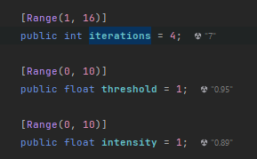

There are 3 main parameters  that I'd want to change. First is iterations, this is how many times the screen is split into smaller bits (Just like in the pixellate code). However, this value also controls how much threshold and intensity is required for the effect to be noticable.
Threshold is how bright an object should be before it starts "Blooming" or emitting light, If the iterations is higher, this should be higher too
Finally is the Intensity, this is how much the brightness should be amplified and spread.

Now all the magic happens in the kernels inside the bloom shader:
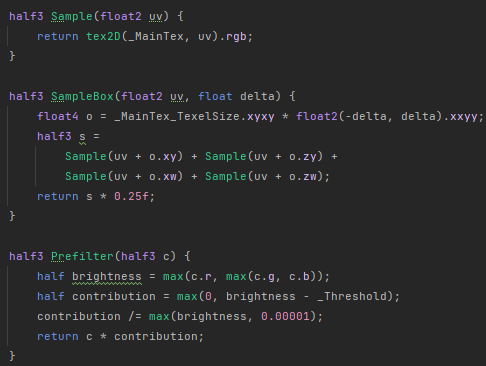

In this image, "Sample Box" acts as a 2x2 kernel *(I believe) that given a position, it samples around that position and returns the new result (Giving us our blurred look)
Additionally there is also the preFilter image, which is used to prevent the user from getting flashbanged as technically the image would stack upon itself. I.E. every single time it brightens the next frame, it'd get brighter and brighter until it was white. but with this function, it stays locked to it's range
Also, this can help / be used to provide the inside --> outside exposure effect

Here's what the final thing looks like

https://sketchfab.com/3d-models/low-poly-shark-58eddd6fbc2448c38efd1e3df3d0f342#download <-- Shark

## I FORGOT A SECTION (Known fact, I can't read long things) This was done at 8:30-8:50 Wednesday night.

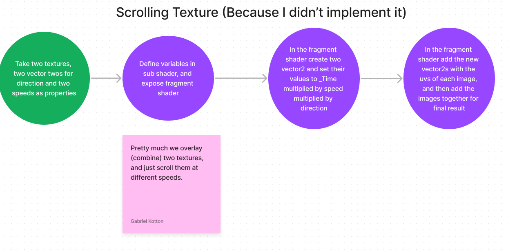
Here is the tiling texture because I pretty much implemented every shader from the second half of the semester in this project.
It's very simple, just take two textures, combine them and offset them at different speeds and directions based on time passed.
This shader can be used to create a flat cartoony water effect, or just a really cool holographic overlay effect like in the unreal engine shooter game... Make it look like the hologram is updating

I was also thinking about the project, and I now see that square waves should have used a step function... Hindsight 20/20 lol

