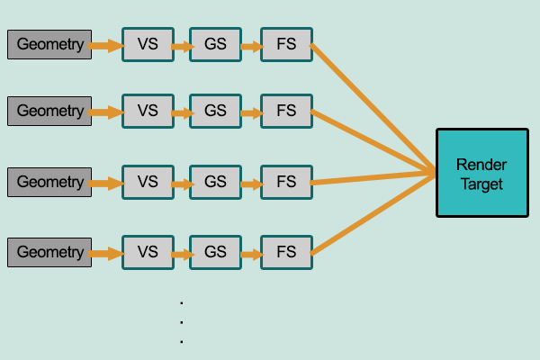

# ICG Indiv 2 Gabe Kotton (100817029)

## Lighting 

Forward rendering is earlier version of rendenring, and is more flexible because each object will under go it's own screen space shading. This provides the benefit of flexibility (as mentioned earlier), but run time operations become more expensive.  

Forward rendering is most commonly used in shader because it provides the advantage of multiple passes. The majority of the shaders we made in class (I believe excluding the shadows) are forwardly rendered. I also believe that most things when made in shaders are forward rendered unless declared otherwise. 

Deferred rendering is an advanced lighting technique commonly used for things like shadows. It takes advantage of the render pipeline by combining everything into one last final step where lighting is calculated in screen space.
This buffer is called the G-Buffer.

As mentioned earlier, deferred rendering is commonly used when making shadows, this is visible inside unity (Atleast HDRP pipelines) where you can see shadow casters as deferred renderers in the  Window->Analysis->HDRP (It's not called HDRP, it's something similar tab

Both options of rendering are valuable and important. Commonly in CG we aim for our things to be on the differed render pipeline to optimize GPU operations, but some operations can only be done on the forward render. 

## Game

Shown above is a gif of the game after the first section include square waves (Note the period and intensity are changable) and a toon shader gives color so the deeper water is darker.

Also, you can move and point your harpoon thing. Though you really shouldn't be killing sharks.

The shader used to get the water look is a combo of water shader & toon ramp shader. 

First; the water shader -- We need to access the verticies of the mesh to achieve a square wave. Then we apply a regular sine wave function to achieve a wave, then we clamp the wave to either be a 1 or -1 (Whichever is closest)

Next, we need to implement our toon ramp && we need to apply our finial colors. So, using a surface shader, and unity black magic, we create our toon ramp which just chooses a multiplicable color based on angle from light.

